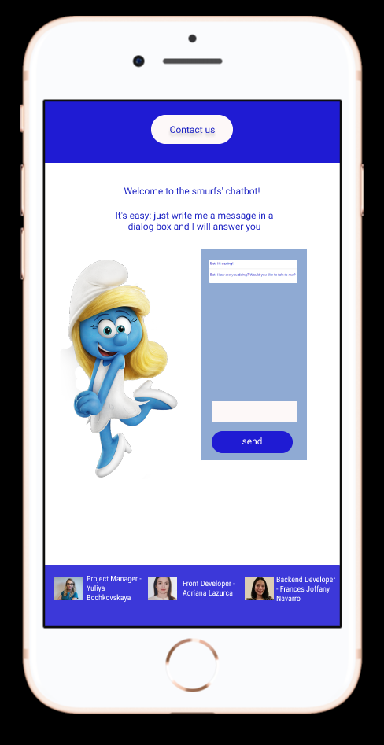
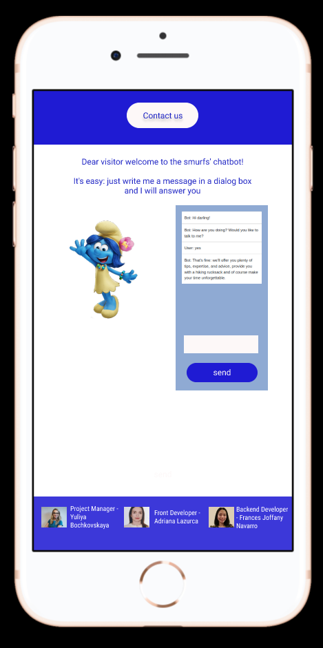
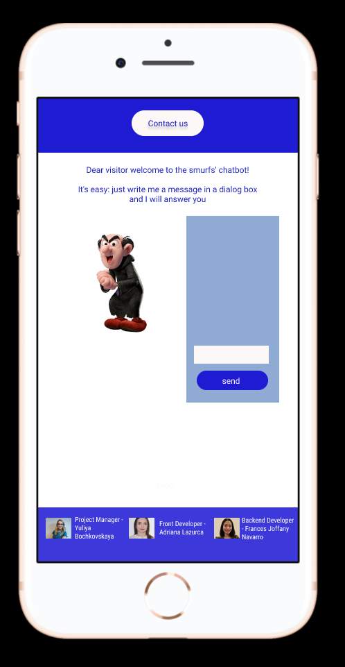
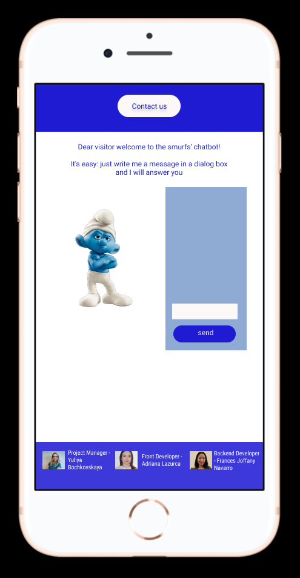

# Javascript

### Welcome to the webpage of our chatbot!

[Link to the chatbot](https://yuliya-becode.github.io/Javascript/)

# What

Please see here below the UX Prototyp of our bot. This UX Prototyp has been created in Figma.

# Why 

A chatbot is a software application used to conduct an on-line chat conversation via text or text-to-speech, in lieu of providing direct contact with a live human agent. A chatbot is a type of software that can automate conversations and interact with people through messaging platforms. 

If you're interested to integrate a chatbot into your daily routine or your business life please check here below some advantages and disadvantages of Chatbots.

### Advantages of Chatbots

   1. Gather Customer Insights

   2. Increase Sales

   3. Available 24/7

   4. Save Money

   5. Improve Customer Satisfaction 

### Disadvantages and Risks of Chatbots

 1. Lack Emotions

 2. Difficult to Create

 3. Made to Handle First-Level Questions

 4. Require Maintenance

*Chatbots have a number of advantages and disadvantages. However, with the introduction of new technologies and software solutions such as ours, the advantages clearly outweigh the disadvantages.*

# When  

The first self-learning bot was created by Microsoft, which tweeted the self-learning chat Tay in 2016.

Today chatbots are often used in business to advise and provide information to clients. For these purposes, chatbots are most often used in social networks or applications.

# How

 ## Our chatbot is very intelligent and can talk to you in the following structure:

1. On loading of the page, the bot welcomes the user with a random greeting message (our bot has at least three different welcoming messages).
    
2. Then, our chatbot asks the user "how do you feel today?".

3. The user can reply freely, and the bot will check in the response if he can find a "yes" or a "no": 

        if the script find a "yes" in the message, the bot answers with a random sentence from a specific set (minimum three different)
        if the script find a "no" in the message, the bot answers with a random sentence from a specific set (minimum three different)
        if the script cannot find a "yes" or a "no" in the message, the bot answer something like "I didn't understand, can you please try again"
        if the script cannot find a "yes" or a "no" in the message after three attempts, our bot begins to be mad and use "passive-agressive" answers, like "dude, are you sure you can read?" 

According to the mood of our boot, a smurf image will be also changed 

#### If the script finds a "yes" in the message

#### If the script finds a "no"

####  If the script cannot find a "yes" or a "no" in the message

4. After this answer, our bot will finish his routine. He says "bye" to the user and the textarea goes to disabled mode.

Sending a message to the bot has been done by clicking the send button.

# Who

Our Project Team consists of

* Front Developer - Adriana Lazurca (@adriana-lazurca)
* Backend Developer - Frances Joffany Navarro (@frances-joffany-navarrofrances)
* Project Manager - Yuliya Bochkovskaya (@Yuliya-beCode)

If you have any questions in regards to our project, please do not hesitate to contact us directly on GitHub
